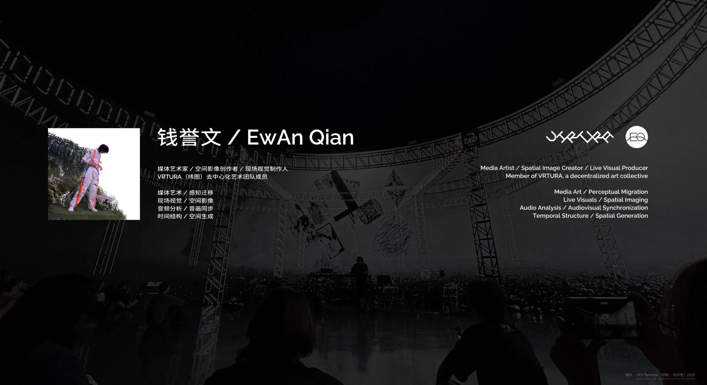
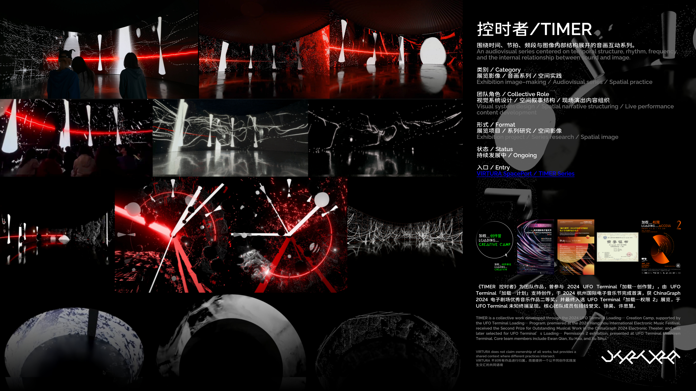
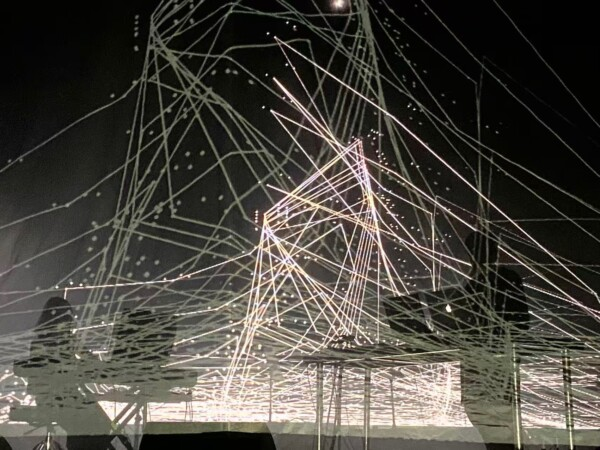
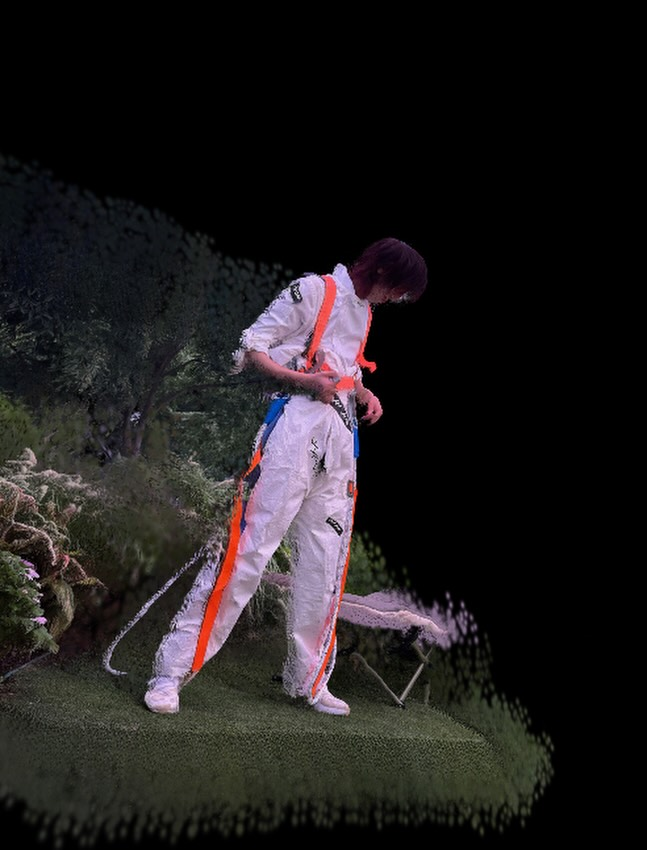

  

# 钱誉文 Ewan Qian

## Media Artist / Spatial Image Creator / Live Visual Producer

> 感知迁移 / 时间结构 / 空间生成 / 现场图像系统

VIRTURA（纬图）去中心化艺术团队成员

---

## Social / Platforms

- [Instagram](https://www.instagram.com/ewanqian/)
- [Bilibili](https://space.bilibili.com/2380485)
- [Xiaohongshu](https://www.xiaohongshu.com/user/profile/60d73226000000000101f30e)
- [ManaMana](https://www.manamana.net/peopleCenter/432894/home#!zh)
- [GitHub](https://github.com/ewanqian)
- [Portfolio](https://ewanqian.github.io/portfolio)

---

## Start Here

- 想快速看代表作品：看 **[Featured Works](#featured-works)**
- 想看完整项目履历：看 **[Projects / Credits](#projects--credits)**
- 想理解我近年的创作方向：看 **[Current Directions](#current-directions)**
- 想阅读研究与写作：看 **[Writing & Research](#writing--research)**
- 想了解合作服务与参考报价：看 **[Production Services / 制作与交付服务](#production-services--制作与交付服务)**
- 想看详细项目类型、FAQ 与参考案例：看 **[Services Details / 服务详情](./services/project-types.md)**

---

## Featured Works

### Drop Flow
围绕空间生成、沉浸式大屏、身体表演与图像离开屏幕展开的系列实践，是我近年关于空间叙事与感知迁移的重要作品线之一。  

[看系列](./visual-arts/drop-flow-series/README.md) · [看详情](./projects/drop-flow-visual-2025.md) · [看录像](https://www.bilibili.com/video/BV1PREczgEzC/?spm_id_from=333.1387.upload.video_card.click&vd_source=cb242067ab3ab2bc069ca22e37a86032)

### TIMER
围绕时间结构、音画关系与感知节奏展开的系列实践，持续处理声音如何进入图像内部并重新组织观看经验。  

[看系列](./visual-arts/timer-series/README.md) · [看录像](https://www.bilibili.com/video/BV1sWNWeVEVB/?spm_id_from=333.1387.upload.video_card.click&vd_source=cb242067ab3ab2bc069ca22e37a86032)

### Kashiwa Daisuke 深圳专场《机械光合：TITAN的全息声林》
与 KASHIWA Daisuke、Yuki Murata 合作的现场视听项目，围绕白空间纵深、雾气、环境过渡与沉浸式错觉展开。我负责项目中的全息纱幕、裸眼 3D 与音画互动视觉部分，并与策划、技术、灯光、声音及场地方团队共同完成整场现场呈现。  

[看系列](./visual-arts/kashiwa-daisuke/README.md) · [看详情](./projects/kashiwa-titan-visual-2025.md) · [看外部资料](https://mp.weixin.qq.com/s/yNjtixkMIF5zXrl03DyU1g)

---

## Selected Public Presentations

这些公开项目涵盖展览、现场演出、工作坊、节展项目与合作呈现，构成了我在公共呈现、现场执行与协作语境中的主要轨迹。  
This selection spans exhibitions, live performances, workshops, festival appearances, and collaborative presentations, outlining the public-facing trajectory of the practice across presentation, production, and collaboration.

- [首届中国（杭州）艺术与科技国际双年展开幕式《滴流》](./projects/drop-flow-visual-2025.md)
- [UFO Terminal《TIMER 控时者》](./visual-arts/timer-series/README.md)
- [Kashiwa Daisuke × Yuki Murata × Ewan Qian 深圳 BO LIVE 专场](./projects/kashiwa-titan-visual-2025.md)
- [《观察与共生》 / Observation and Symbiosis](./visual-arts/perceptual-environments/README.md)
- [UFO Terminal × PRE / Rooooooom719 Audiovisual Live](./visual-arts/drop-flow-series/README.md)
- [杭州中心美术馆《巴别瓶》](./projects/new-media-artist-simulator-2025.md)

---

## Practice Lines / 作品主线

我的实践可以理解为五条相互关联的主线，它们分别从不同角度处理空间、时间、感知与技术的关系：

### 1. TIMER / 时间结构
围绕时间结构、音画关系与感知节奏展开的系列实践，持续处理声音如何进入图像内部并成为组织材料。  
[代表作品](./visual-arts/timer-series/README.md)

### 2. Drop Flow / 空间生成
围绕空间生成、沉浸式图像、身体表演与图像离开屏幕展开，不只是画面，而是图像如何与空间、身体和观看关系一起工作。  
[代表作品](./visual-arts/drop-flow-series/README.md)

### 3. Perceptual Environments / 扫描与数字环境
扫描空间、点云环境、数字采样、观察与共生，处理数字空间中的生命感、破碎感与未完成状态。  
[代表作品](./visual-arts/perceptual-environments/README.md)

### 4. Audiovisual Collaborations / 现场合作与舞台结构
与音乐人、现场演出、展览空间的合作，探索现场语境中视觉如何从背景走向结构。  
[代表作品](./visual-arts/kashiwa-daisuke/README.md)

### 5. Perceptual Migration / 感知迁移与接口研究
不是单一作品，而是一系列关于作品如何跨设备、跨界面、跨空间迁移的研究与实践。  
[相关写作与研究](#writing--research)

---

## Short Bio

钱誉文（Ewan Qian）是一位媒体艺术家、空间影像创作者与现场视觉制作人，工作横跨现场演出视觉、展览影像、沉浸式空间与数字媒介系统。他的实践关注图像、声音、时间与空间如何共同构成一种可进入、可感知、可被重新组织的现场经验，并持续在艺术创作、现场制作与系统方法之间建立自己的工作路径。

其作品与合作项目已在北京、上海、深圳、杭州、重庆、东京等地公开呈现，涵盖现场演出视觉、展览空间、数字环境、扫描实践与跨媒介影像系统。同时，其个人实践也持续与 VIRTURA 的团队创作网络发生交叉与协作。

Ewan Qian is a media artist, spatial image creator, and live visual producer working across live performance visuals, exhibition image-making, immersive environments, and digital media systems. His practice focuses on how image, sound, time, and space can be composed into experiences that are not only seen, but entered, sensed, and reorganized, while continuously developing a working path between artistic creation, live production, and system-based methodology.

His works and collaborations have been publicly presented in Beijing, Shanghai, Shenzhen, Hangzhou, Chongqing, and Tokyo, spanning live visuals, exhibition environments, digital landscapes, scanning-based practice, and cross-media image systems.

### 核心方向

- **Media Art / Perceptual Migration** 媒体艺术 / 感知迁移
- **Live Visuals / Spatial Imaging** 现场视觉 / 空间影像
- **Audio Analysis / Audiovisual Synchronization** 音频分析 / 音画联动
- **Temporal Structure / Spatial Generation** 时间结构 / 空间生成

> 更完整的项目列表与版本线索，请见后文的 [Projects / Credits](#projects--credits)

---

## Ideal Collaborations / 适合合作的项目类型

我目前更希望合作的项目，主要集中在以下几类：

- **品牌与企业的视觉内容开发**  
  包括 15–30 秒短视频、活动预热视觉、企业形象内容、社交媒体传播素材与系列化内容更新。

- **舞台视觉、演出影像与投影内容**  
  包括明星演出、音乐现场、发布会、投影空间、环幕 / 多面屏 / 沉浸式空间的视觉内容开发与版本整理。

- **AI + 三维内容结合的视觉项目**  
  包括概念视觉开发、风格测试、数字环境生成、AI 与三维结合的提案开发，以及视觉系统的前期设计。

- **双目视频 / Apple Vision Pro / XR 展示内容**  
  包括双目影像、空间观看内容、数字环境、沉浸式演出背景和 XR 方向定制视觉。

- **数字展览、线上专展与展示系统**  
  包括艺术家线上专展、数字展览策划、作品整理、展品页面、展后资料与展示入口系统。

- **课程、讲座、工作坊与咨询合作**  
  包括 VR / XR 基础课程、AI 视觉工作流、数字展览与内容组织、创作流程优化与项目咨询。

---

## Team Theory & Research / 团队理论与研究体系

完整版本保存在 **[VIRTURA-SpacePort 团队仓库](https://github.com/ewanqian/VIRTURA-SpacePort/tree/main/knowledge-network/our-theory)**。这里保留与个人实践最相关的入口：

- 感知迁移理论
- 智力装备理论
- 空间创作框架

> [查看完整团队理论体系 → VIRTURA-SpacePort](https://github.com/ewanqian/VIRTURA-SpacePort)

---

## Current Directions

过去几年，我的工作逐渐从"影像制作"转向"感知结构设计"。如果用更清楚的方式概括，目前主要在推进以下几个方向：

### 近期实践转向：Web-first / MR-optional

我当前的实践重点已从"设备导向的空间计算展示"调整为：**先做 web-first 的交互出版物、训练模拟器与项目推演系统，MR / 头显仅作为成熟系统后的可选展示层**。

这一调整基于以下判断：
- 人们首先需要"把事情搞清楚"，然后才是"把事情沉浸化"
- 网页端更低摩擦、更易传播、更易版本化、更易被 Agent 索引和引用
- 感知迁移首先是一种内容组织方式，而不是设备选择

当前优先推进：
1. **P0：网页端交互出版物 / 节点化阅读器**
2. **P1：训练模拟器 / 智力装备**
3. **P2：项目推演器 / Digital Library 与 Digital Stage 的工具层**
4. **P3：MR / 空间计算展示层（可选）**

### Spatial Consciousness Transfer
我关心观众如何在空间中经历一种状态的转换。这种转换不是叙事意义上的"理解"，而是感知层面的重新定位、重新分布与重新组织。

### States of Entry
我尝试构建一种进入机制：观众不是站在作品外部观看，而是通过节奏、空间、光线、界面和行为逻辑，被带入某种结构之中。进入，本身就是作品的一部分。

### Perceptual Migration Systems
我越来越关注作品如何跨设备、跨界面、跨空间条件迁移。单屏、环幕、网页播放器、空间计算界面、档案文档——这些并不只是载体差异，而是感知被重新组织的不同条件。我希望这种迁移不是损耗，而是可被设计的系统。

### 从情感容器到感知迁移
过去我曾将一部分工作理解为"情感容器"的构建：也就是如何让空间化表达形成可感知、可共鸣、可持续的情绪经验。现在，这条线进一步升级为"感知迁移"：不仅关注情绪如何被承载，也关注意识如何在不同结构中被触发、移动和重组。前者更强调体验的容纳，后者更强调状态的转移与结构的变化。

---

## Writing & Research

除了项目和作品，我也在持续整理与发布个人写作。这些文本不是项目说明的附属物，而是实践本身的一部分。

目前我最希望被优先阅读的几类文本包括：

- 关于个人作品线如何收束为一条实践主线的文章
- 关于"感知迁移"如何从旧有概念升级而来的研究性文本
- 关于数字空间、扫描环境、迁移媒介与空间计算接口的长期写作
- 关于个人在团队项目中的角色、边界与方法位置的说明性文本

我希望这些文本逐渐形成一个更清楚的结构：

1. **Artist Writing**：艺术家的自我书写与作品思考
2. **Practice Notes**：从具体项目中提炼出的方法与判断
3. **Research Notes**：从情感容器、数字内容到感知迁移的概念升级
4. **Interface Studies**：关于未来空间计算与人工智能环境中感知接口的研究

### 优先阅读文本

以下是我关于艺术实践与研究方向的核心文章，完整内容保存在 **[VIRTURA-Newsroom](https://github.com/ewanqian/VIRTURA-Newsroom)**：

| 标题 | 描述 |
|------|------|
| 从信号到迁移：我的作品线索 | 梳理从早期信息流实验到感知迁移实践的创作脉络 |
| 从情感容器到感知迁移：关于感知接口的研究说明 | 阐述研究方向从"情感容器"到"感知迁移"的演进 |
| Artist Practice Map：我的创作轴线 | 五条创作轴线的清晰梳理（时间结构/空间生成/现场装置/扫描生态/迁移媒介） |

**[阅读全文 → VIRTURA-Newsroom](https://github.com/ewanqian/VIRTURA-Newsroom)**

---

## Core Capabilities / 核心能力

### 1. AI 视觉内容开发与短视频制作
我可以使用 AI 工具快速完成适合品牌传播、活动预热和社交媒体发布的视觉内容开发，包括 15 秒左右的短视频、动态视觉片段、概念画面与系列化传播素材。可负责从脚本梳理、视觉方向设定到出片测试的完整前期流程，适合企业形象、品牌活动、项目发布和长期内容服务合作。

### 2. AI 影像生成与多工具工作流
我熟悉将不同 AI 工具组合进一个实际可交付的工作流中，包括文生图、图生图、图生视频、视频生成与控制性生成。常用工具包括即梦、可灵、TapNow、ComfyUI、Stable Diffusion、ControlNet 等。我更关注它们在真实项目中的配合方式，而不是单一工具本身。

### 3. AI 与三维内容结合的视觉开发
除了单纯使用 AI 生成，我也会把 AI 与三维内容、空间影像和现场视觉结合起来，用于概念开发、风格测试、视觉延展和项目提案。对我来说，AI 更像是前期开发、视觉探索和流程加速的辅助层，而不是最终作品价值的替代。

### 4. 舞台视觉、空间影像与沉浸式内容
我主要工作在现场演出视觉、舞台内容、投影空间、沉浸式大屏和数字空间相关项目中，能够根据场地结构、屏幕比例、视觉节奏和现场流程去整理内容，而不只是做单张画面。适合需要舞台视觉、演出影像、空间投影、品牌发布内容和沉浸式展示内容的合作。

### 5. 双目视频 / XR / Apple Vision Pro 内容开发
我具备双目 / stereo 影像、数字环境和空间观看方向的开发能力，适合 Apple Vision Pro、XR 展示、双目演出背景和沉浸式数字环境内容定制。除了影像制作本身，我也会同时考虑平台格式、观看方式、环境风格和内容延展性。

### 6. 音画互动系统与视觉系统整合
我会把声音、节奏、段落和视觉状态整理成可控制的结构，用于演出视觉、互动内容和实验性数字项目。除了视觉制作本身，我也会结合三维内容、音频分析、实时系统和页面/展示逻辑，把概念进一步整理成可演示、可测试、可交付的方案。

### 7. 项目归档、页面组织与公开表达
除了制作内容本身，我也重视项目归档、系列页、项目页、策展说明、公开入口和版本记录的整理，让作品、研究与协作过程能够被持续阅读、调用和复盘。这也是我长期工作方法的一部分。

### 8. 课程、培训、工作坊与咨询支持
我也在持续把视觉、数字空间、XR/VR 和 AI 工作流整理成课程、训练和咨询型服务。包括 Unity / XR 基础内容、VR 教学与实训框架、数字展览与内容组织、创作流程优化与项目咨询。此前我已整理过适用于本科层次的 VR 实习培训课纲，内容覆盖从媒介认知到 Unity VR 小组 Demo 制作的完整训练路径，可用于院校和机构合作参考

### AI Tools in Practice / 人工智能工具的使用
我会把人工智能工具用于资料整理、脚本辅助、视觉测试、内容生成、方案发散和流程搭建，以提高前期开发和中后期整理效率。但 AI 在我的工作中主要承担辅助角色，不替代项目判断本身。最终的画面取舍、空间关系、叙事方向和交付方式，仍然需要人工判断和实际测试来完成。

---

## 行业分享与交流活动

| 时间 | 主题 | 角色 |
|------|------|------|
| 2026.01 | [上海·愚见观池｜情感容器构建工作坊](./workshops/202601-愚见观池-情感容器工作坊.md) | 主讲人 |
| 2025.05 | [线上（B站/小红书/CCtalk）｜5天直播工作坊](./workshops/202505-线上-5天直播工作坊.md) | 主讲人&课程设计 |
| 2025.04.03 | [上海·巨鹿路Cedar Kitchen｜重新定义数字空间](./workshops/202504-巨鹿路-半成品沙龙.md) | 分享嘉宾 |
| 2024.12.27 | [上海·漕河泾AI校友中心｜AI+3D空间交互艺术创作工坊](./workshops/202412-漕河泾-AI3D工坊.md) | 特邀分享嘉宾 |
| 2024.07 | [芬兰·阿尔托大学｜VR暑期学校](./workshops/202407-阿尔托大学-VR暑期学校.md) | 参训学员 |
| 2020.01.14-20 | [上海｜OF COURSE｜Processing音画互动创作](./workshops/201901-OFCOURSE-Processing工作坊.md) | 参训学员 |

---

## Projects / Credits

这里整理的是我个人实践相关的项目线索。其中既包括个人作品，也包括我在团队项目中承担了明确结构判断、视觉构成、系统实验或空间方法的实践部分。这既尊重团队合作本身，也保留我个人实践线索的连续性。

> 详细项目列表可查看 [projects](./projects/)

### 演艺舞台

| 时间 | 项目 | 角色 | 所属主线 |
|------|------|------|----------|
| 26/01 | [Rain 新加坡跨年专场](./projects/rain-singapore-visual-2026.md) | 曲目+Opening视觉 | Audiovisual Collaborations |
| 25/11 | [余佳运「45㎡」演唱会](./projects/yujiayun-45ping-visual-2025.md) | Opening+舞台视觉 | Audiovisual Collaborations |
| 25/10 | [Kashiwa Daisuke 深圳专场](./projects/kashiwa-titan-visual-2025.md) | 视觉制作（全息纱幕 / 裸眼3D / 音画互动） | Audiovisual Collaborations |
| 25/10 | [Can Festival 舟山](./projects/kashiwa-band-visual-2025.md) | 舞台视觉（参与部分） | Audiovisual Collaborations |
| 25/08 | [爱丁堡《山海浮生II》](./projects/shanhaifusheng2-visual-2025.md) | 舞台视觉 | Audiovisual Collaborations |
| 23/12 | [@onefive Underground](./projects/onefive-underground-visual-2023.md) | 视觉制作 | Audiovisual Collaborations |
| 23/11 | [@onefive Overground](./projects/onefive-overground-visual-2023.md) | 视觉制作 | Audiovisual Collaborations |
| 23/10 | [上海广播艺术中心「孤独？」](./projects/lonely-av-live-2023.md) | 舞台视觉 | Audiovisual Collaborations |
| 22/10 | [谢欣舞蹈剧场《四相》《汞》](./projects/xiexindance-sixiang-gong-visual-2022.md) | 影像视觉 | Audiovisual Collaborations |
| 22/09 | [上海时装周XTEP-XDNA](./projects/xtep-xdna22aw-visual-2022.md) | 视频制作 | Audiovisual Collaborations |
| 22/11 | [Germany Hamburg《Water Music》](./projects/watermusic-multi-visual-2022.md) | 多媒体视觉 | Audiovisual Collaborations |

### 混合媒介

| 时间 | 项目 | 角色 | 所属主线 |
|------|------|------|----------|
| 26/01 | [《观察与共生》Workshop](./projects/observe-symbiosis-workshop-2026.md) | 高斯扫描/方法分享 | Perceptual Environments |
| 25/10 | [首届中国（杭州）艺术与科技国际双年展开幕式「滴流」](./projects/drop-flow-visual-2025.md) | 沉浸式大屏+VR头显 | Drop Flow |
| 25/11 | 重庆「流光绘影」光影科技艺术节「滴流」 | 异形屏幕装置 | Drop Flow |
| 25/09 | [杭州国际电子音乐节「滴流」一等奖](./projects/derive-dual-city-2024.md) | 多媒体视觉合作 | Drop Flow |
| 25/07 | UFO Terminal「滴流3.0」 | 音画互动现场 | Drop Flow |
| 25/07 | [西安万象城「数字游园」](./projects/digital-garden-visual-2025.md) | Unity VFX Graph | Perceptual Environments |
| 25/07 | [深圳坪山「观察与共生」](./projects/observe-symbiosis-exhibit-2025.md) | 数据可视化 | Perceptual Environments |
| 25/08 | [杭州中心「巴别瓶」](./projects/new-media-artist-simulator-2025.md) | 交互作品参展 | Perceptual Environments |
| 25/08 | [上海西岸漩心](./projects/westbund-ambient-visual-2025.md) | 环境视觉 | Perceptual Environments |
| 23/11 | [西岸艺术博览会「以太碎片」](./projects/ether-fragment-exhibit-2023.md) | 影像展映 | Perceptual Environments |
| 23/08 | [上海K11「观察与共生」](./projects/observe-symbiosis-k11-2023.md) | 视频装置 | Perceptual Environments |
| 23/01 | [安昌光影艺术季](./projects/glance-thousand-install-2023.md) | 古桥投影 | Perceptual Environments |
| 22/12 | [深圳光影艺术季AR](./projects/ar-shenzhen-resort-2022.md) | AR作品 | Perceptual Environments |
| 22/09 | [西岸凤巢AI PLAZA](./projects/meta-speaker-install-2022.md) | 数字艺术 | Perceptual Environments |

---

## Visual Arts / 作品系列

> 个人创作系列 [更多](./visual-arts/)

- **TIMER 系列**
  围绕时间结构、音画关系与感知节奏展开的系列实践，ChinaGraph 2024 电子剧场二等奖
  [主链接](./visual-arts/timer-series/README.md)
- **Drop Flow 系列**
  围绕空间生成、沉浸式图像与身体表演展开的系列实践，杭州双年展开幕作品
  [主链接](./visual-arts/drop-flow-series/README.md)
- **Perceptual Environments / 扫描与数字环境**
  扫描空间、点云环境、观察与共生，处理数字环境中的生命感
  [主链接](./visual-arts/perceptual-environments/README.md)
- **Kashiwa Daisuke 系列**
  与日本音乐人合作的现场视听项目，包括深圳 BO LIVE 与 CAN Festival
  [主链接](./visual-arts/kashiwa-daisuke/README.md)
- **日常练习**
  Blender/扫描/点云持续更新
  [主链接](./visual-arts/daily-practice/)

---

## 研究项目与工具

### Research & Archive / 研究与档案入口
- **VIRTURA-SpacePort** — 团队公开入口、档案数据库与叙事门面 [GitHub](https://github.com/ewanqian/VIRTURA-SpacePort)
- **VIRTURA-Newsroom** — 个人写作、研究文本与项目思考 [GitHub](https://github.com/ewanqian/VIRTURA-Newsroom)

### Tools & Experiments / 工具与实验项目
- **SceneForge** — 网页端场景查看器 / 舞台预演器 `Active` [GitHub](https://github.com/ewanqian/SceneForge)
- **LiveForge** — 冻结中的历史概念仓，后续并入 SceneForge `Archived` [GitHub](https://github.com/ewanqian/LiveForge)
- **RepoForge** — 仓库自动化管理工具壳，对应私有 Forge `Experimental` [GitHub](https://github.com/ewanqian/RepoForge)
- **Senia-Digital-Resort** — Minecraft 空间感知实验 `Experimental`

---

## Production Services / 制作与交付服务

以下为常见合作方向与当前参考区间，便于快速判断合作方式。  
最终报价会根据时长、复杂度、交付版本、修改轮次、是否需要现场配合及版权范围进行调整。

### 1. AI 视觉短视频与传播内容
适用于品牌传播、企业形象、活动预热与社交媒体内容开发。

| 服务内容 | 说明 | 参考价格 |
|---|---|---|
| 15 秒内 AI 视觉短视频 | 适合抖音 / 小红书 / 活动预热 / 品牌测试 | **¥1000 / 条起** |
| 15–30 秒 AI 视觉短视频 | 含基础镜头组织与节奏处理 | **¥2500 / 条起** |
| 30 秒以上或含剪辑整合版本 | 含脚本整理、剪辑、视觉延展与多轮调整 | **¥3000–5000 / 条起** |
| 系列化月度内容合作 | 适合品牌连续更新或活动周期传播 | **按项目咨询** |

### 2. AI + 三维视觉开发与概念提案
适用于前期视觉提案、风格探索、概念测试与数字环境开发。

| 服务内容 | 说明 | 参考价格 |
|---|---|---|
| 概念视觉开发 / moodboard / 风格探索 | 适合提案前期、方向确认 | **¥1500 起** |
| AI + 三维视觉方案测试 | 适合场景风格测试、空间视觉方向开发 | **¥3000 起** |
| 提案包（参考图 / 脚本方向 / 视觉草案） | 适合品牌项目、展览、舞台前期 | **¥3000–8000** |

### 3. 舞台视觉、投影内容与空间影像
适用于舞台演出、品牌发布、沉浸式空间、投影映射与多屏内容。

| 服务内容 | 说明 | 参考价格 |
|---|---|---|
| 单条视觉内容开发 | 单段视觉、loop、背景内容 | **¥3000 起** |
| 开场视觉 / Opening Visual | 适合演唱会、音乐现场、发布会等关键段落，通常需要更高完成度与更强结构控制 | **¥8000–30000+** |
| 艺人演出视觉 / 曲目视觉开发 | 按单曲 / 段落 / 套组计算，适合演唱会、巡演、音乐节、live set | **¥5000–20000+ / 段** |
| 定制舞台 / 投影空间视觉 | 根据屏幕比例、节奏、空间条件开发 | **¥5000–20000+** |
| 多段内容 / 多屏适配 / 沉浸式空间项目 | 含不同版本与空间适配 | **按需求报价** |

### 4. 双目视频 / Apple Vision Pro / XR 内容
适用于双目影像、空间观看、沉浸式数字环境与 XR 方向定制内容。

| 服务内容 | 说明 | 参考价格 |
|---|---|---|
| 双目 / Stereo 视觉内容测试版 | 适合 Proof of Concept / 样片开发 | **¥5000 起** |
| 双目演出背景视觉 | 适合艺人舞台背景、沉浸式视觉、数字环境定制 | **¥8000–30000+** |
| Apple Vision Pro / XR 展示内容 | 适合空间观看、作品展示、双目环境和轻量交互演示 | **¥10000–40000+** |
| XR / VR 场景化内容开发 | 含空间结构、观看路径、版本适配 | **按项目报价** |

> 说明：双目内容、空间视频与 XR 项目差异较大，通常建议先沟通目标平台、分辨率、时长、交付格式与展示场景。

### 5. 工程调试、内容整理与流程咨询
适用于别人的项目工程需要整理、调试、优化或结构梳理。

| 服务内容 | 说明 | 参考价格 |
|---|---|---|
| 工程整理 / 调试 / 内容结构建议 | 适合发工程给我协助检查、整理、优化 | **¥800–1500 / 次起** |
| 视觉系统 / 演出内容 / 归档结构咨询 | 适合项目流程、视觉结构、内容组织梳理 | **¥1000 / 小时** |
| 深度项目咨询 / 系统诊断 | 适合复杂项目、长期合作前的方向确认 | **¥2000 起 / 次** |
| 内容工作流搭建建议 | 适合 AI 工作流、视觉生产流程、版本管理与资料组织 | **按项目咨询** |

### 6. 数字展览、线上专展与展示系统
适用于艺术家线上专展、数字展览与展示入口整理。

| 服务内容 | 说明 | 参考价格 |
|---|---|---|
| 艺术家线上专展整理 | 适合作品集、展品页、公开入口整理 | **¥5000 起** |
| 数字展览策划与页面组织 | 含展品分类、页面逻辑、展示叙述 | **¥8000 起** |
| 展品结构、文案、页面与反馈系统 | 适合较完整展示项目 | **按项目报价** |

### 7. 课程、讲座、工作坊与培训
适用于院校、机构、企业培训与创意教育合作。

| 服务内容 | 说明 | 参考价格 |
|---|---|---|
| 咨询 / 课程讨论 | 线上会议、方法咨询、内容答疑 | **¥1000 / 小时** |
| 单次讲座 / 分享 | 面向院校、机构、企业内部分享 | **¥1500–3000 / 场** |
| 半天工作坊 | 适合 AI 视觉、数字展览、XR 基础入门 | **¥4000–6000 起** |
| 一天工作坊 | 含案例、演示、结构化训练 | **¥8000–12000 起** |
| 两周实训 / 系统课程合作 | 适合院校与系统训练项目 | **¥20000 起** |

### 8. 定制开发与实验性项目
适用于数字空间体验、轻量交互系统、展示入口、ARG 原型、页面化作品结构和实验型服务设计。

| 服务内容 | 说明 | 参考价格 |
|---|---|---|
| 数字空间体验原型 | 适合艺术项目、展示原型、概念验证 | **¥5000 起** |
| 轻量交互展示系统 / 页面结构 | 适合作品浏览、项目展示、交互入口 | **¥8000 起** |
| ARG / 数字叙事 / 服务设计型项目 | 适合需要整体流程设计与结构搭建的合作 | **按项目报价** |

### 9. 长期合作与持续服务
适用于需要持续视觉更新、项目整理、页面维护或内容开发的客户。

| 服务内容 | 说明 | 参考价格 |
|---|---|---|
| 月度视觉内容支持 | 适合品牌、机构、项目方持续更新需求 | **按月咨询** |
| 长期顾问 / 视觉方向支持 | 适合项目周期较长、阶段需求较多的合作 | **按项目咨询** |
| 定制化 production 合作 | 适合阶段性深度参与、工程交付与方法支持 | **按项目报价** |

### Notes / 说明
- 以上价格为**参考起步区间**，具体合作会根据复杂度、版本数量、修改轮次、是否需要现场配合及版权范围进行调整。
- 长期合作、系列内容、课程合作和系统性项目，可单独沟通更合适的合作方式。
- 若项目还在早期阶段，也可以先从咨询、提案包或测试样片开始。
- 工程整理、流程咨询与调试类服务，建议先发送项目简介或结构截图，以便更准确判断工作量。

> 查看更完整的服务分类、合作方式、FAQ 与案例说明 → [Services / 服务总览](./services/README.md)

---

## Contact / 联系方式

如有项目合作、内容委托、课程培训或咨询需求，欢迎联系。  
For project collaborations, commissions, workshops, or consulting, feel free to reach out.

### Preferred Contact / 优先联系
- [小红书私信](https://www.xiaohongshu.com/user/profile/60d73226000000000101f30e)

### Business Email / 业务邮箱
- [qianewan@gmail.com](mailto:qianewan@gmail.com)

如项目涉及预算、周期、交付方式或团队协作，建议在第一条消息中尽量说明以下信息：
- 项目类型
- 预期用途
- 时长或规模
- 时间节点
- 预算范围
- 是否已有素材 / 工程 / 脚本

> 目前不公开微信号和手机号，主要通过小红书私信与业务邮箱进行合作沟通。

---

## 链接与开源仓库

- 个人GitHub：[https://github.com/ewanqian](https://github.com/ewanqian)
- 个人作品集官网：[https://ewanqian.github.io/portfolio](https://ewanqian.github.io/portfolio)
- VIRTURA-Newsroom：[https://github.com/ewanqian/VIRTURA-Newsroom](https://github.com/ewanqian/VIRTURA-Newsroom)
- 团队公开入口：[VIRTURA-SpacePort](https://github.com/ewanqian/VIRTURA-SpacePort)
- 核心工具主线：[SceneForge](https://github.com/ewanqian/SceneForge)

---

## Ongoing

这个仓库会持续更新。它既记录已经发生过的作品，也记录一条仍在展开的实践线。我希望它最终不只是一个项目列表，而是一个可以被反复进入、阅读和重新组织的个人入口。

> 本页面内容将持续更新
> 知识产权归钱誉文 Ewan Qian 所有，未经允许禁止商用
> 开源项目遵循MIT协议
