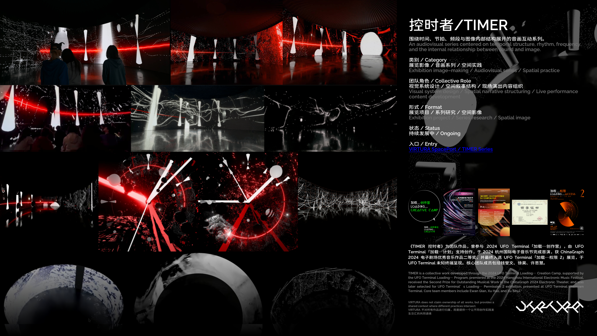
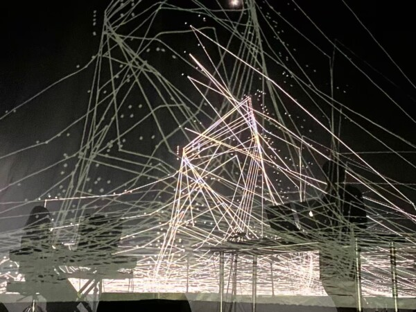

# 钱誉文 Ewan Qian

## Media Artist / Spatial Image Creator / Live Visual Producer

> 感知迁移 / 时间结构 / 空间生成 / 现场图像系统

VIRTURA（纬图）去中心化艺术团队成员

---

## Social / Platforms

- [Instagram](https://www.instagram.com/ewanqian/)
- [Bilibili](https://space.bilibili.com/2380485)
- [Xiaohongshu](https://www.xiaohongshu.com/user/profile/60d73226000000000101f30e)
- [ManaMana](https://www.manamana.net/peopleCenter/432894/home#!zh)
- [GitHub](https://github.com/ewanqian)
- [Portfolio](https://ewanqian.github.io/portfolio)

---

## Start Here

- 想快速看代表作品：看 **[Featured Works](#featured-works)**
- 想看完整项目索引：看 **[Projects Index](./projects/README.md)**
- 想看对象化数据库：看 **[Database Layer](./database/README.md)**
- 想理解个人定位与方向：看 **[Public Positioning](./about/public-positioning.md)**、**[Current Directions](./about/current-directions.md)**
- 想看能力与方法：看 **[Core Capabilities](./about/core-capabilities.md)**
- 想看实践主线、研究入口和工具路线：看 **[Practice Ecosystem](./about/practice-ecosystem.md)**
- 想了解合作服务：看 **[Services Directory](./services/README.md)**、**[Collaboration Overview](./services/collaboration-overview.md)**
- 想继续扩展到前台内容系统：看 **[Content Schema](./content/README.md)**

---

## Node Weaver

Node Weaver 是我当前用于整理作品线、公开节点、资产与关系结构的本地内容系统。它不是传统 CMS，而更像一套面向创作记忆、版本线索与未来复用的基础设施：不是只为了把内容存下来，而是为了把曾经脱链的作品、判断、方法和支线重新接回一个可进入的网络里。

它现在主要负责：

- 把作品、节点、资产和关系整理成更稳定的结构
- 清理命名重复、版本混层和归属混乱
- 给 portfolio、archive 与 agent 工作流提供 public-safe 的内容基础

它的独立公开说明目前也在同步整理中，会保持和这个 portfolio 里的主线、节点与方法表述一致。

---

## Featured Works

### Drop Flow
围绕空间生成、沉浸式大屏、身体表演与图像离开屏幕展开的系列实践，是我近年关于空间叙事与感知迁移的重要作品线之一。  

[看系列](./visual-arts/drop-flow-series/README.md) · [看详情](./projects/drop-flow-visual-2025.md) · [看录像](https://www.bilibili.com/video/BV1PREczgEzC/?spm_id_from=333.1387.upload.video_card.click&vd_source=cb242067ab3ab2bc069ca22e37a86032)

### TIMER
围绕时间结构、音画关系与感知节奏展开的系列实践，持续处理声音如何进入图像内部并重新组织观看经验。  

[看系列](./visual-arts/timer-series/README.md) · [看录像](https://www.bilibili.com/video/BV1sWNWeVEVB/?spm_id_from=333.1387.upload.video_card.click&vd_source=cb242067ab3ab2bc069ca22e37a86032)

### Kashiwa Daisuke 深圳专场《机械光合：TITAN的全息声林》
与 KASHIWA Daisuke、Yuki Murata 合作的现场视听项目，围绕白空间纵深、雾气、环境过渡与沉浸式错觉展开。我负责项目中的全息纱幕、裸眼 3D 与音画互动视觉部分，并与策划、技术、灯光、声音及场地方团队共同完成整场现场呈现。  

[看系列](./visual-arts/kashiwa-daisuke/README.md) · [看详情](./projects/kashiwa-titan-visual-2025.md) · [看外部资料](https://mp.weixin.qq.com/s/yNjtixkMIF5zXrl03DyU1g)

---

## Public Trajectory / 公开轨迹

这些入口保留了当前最适合快速阅读的公开轨迹：

- [首届中国（杭州）艺术与科技国际双年展开幕式《滴流》](./projects/drop-flow-visual-2025.md)
- [UFO Terminal《TIMER 控时者》](./visual-arts/timer-series/README.md)
- [Kashiwa Daisuke × Yuki Murata × Ewan Qian 深圳 BO LIVE 专场](./projects/kashiwa-titan-visual-2025.md)
- [《观察与共生》 / Observation and Symbiosis](./visual-arts/perceptual-environments/README.md)
- [杭州中心美术馆《巴别瓶》](./projects/new-media-artist-simulator-2025.md)

更多作品主线、个人定位、当前方向、能力说明，已经迁移到：

- [Public Positioning](./about/public-positioning.md)
- [Current Directions](./about/current-directions.md)
- [Core Capabilities](./about/core-capabilities.md)
- [Projects Index](./projects/README.md)
- [Database Layer](./database/README.md)
- [Services Directory](./services/README.md)

## 行业分享与交流活动

| 时间 | 主题 | 角色 |
|------|------|------|
| 2026.01 | [上海·愚见观池｜情感容器构建工作坊](./workshops/202601-愚见观池-情感容器工作坊.md) | 主讲人 |
| 2025.05 | [线上（B站/小红书/CCtalk）｜5天直播工作坊](./workshops/202505-线上-5天直播工作坊.md) | 主讲人&课程设计 |
| 2025.04.03 | [上海·巨鹿路Cedar Kitchen｜重新定义数字空间](./workshops/202504-巨鹿路-半成品沙龙.md) | 分享嘉宾 |
| 2024.12.27 | [上海·漕河泾AI校友中心｜AI+3D空间交互艺术创作工坊](./workshops/202412-漕河泾-AI3D工坊.md) | 特邀分享嘉宾 |
| 2024.07 | [芬兰·阿尔托大学｜VR暑期学校](./workshops/202407-阿尔托大学-VR暑期学校.md) | 参训学员 |
| 2020.01.14-20 | [上海｜OF COURSE｜Processing音画互动创作](./workshops/201901-OFCOURSE-Processing工作坊.md) | 参训学员 |

---

## Practice Ecosystem / 实践生态

根 `README` 不再继续堆叠实践主线、研究入口、工具路线与公开仓库说明。  
这些高价值信息已经迁移到：

- [Practice Ecosystem](./about/practice-ecosystem.md)
- [Projects Index](./projects/README.md)
- [Database Layer](./database/README.md)

如果你希望按“作品主线”和“研究支撑”来理解这套仓库，建议先从 `Practice Ecosystem` 进入。

---

## Collaboration / 合作与联系

合作说明已经迁移到服务目录，不再在根 `README` 重复堆叠：

- [Services Directory](./services/README.md)
- [Collaboration Overview](./services/collaboration-overview.md)
- [Pricing Policy](./services/pricing-policy.md)
- [Inquiry](./services/inquiry.md)

优先联系：

- [小红书私信](https://www.xiaohongshu.com/user/profile/60d73226000000000101f30e)
- [qianewan@gmail.com](mailto:qianewan@gmail.com)

---

## Repositories / 仓库入口

- [GitHub](https://github.com/ewanqian)
- [Portfolio](https://ewanqian.github.io/portfolio)
- [VIRTURA-Newsroom](https://github.com/ewanqian/VIRTURA-Newsroom)
- [VIRTURA-SpacePort](https://github.com/ewanqian/VIRTURA-SpacePort)
- [SceneForge](https://github.com/ewanqian/SceneForge)

---

## Ongoing

这个仓库会持续更新。它既记录已经发生过的作品，也记录一条仍在展开的实践线。我希望它最终不只是一个项目列表，而是一个可以被反复进入、阅读和重新组织的个人入口。
> 知识产权归钱誉文 Ewan Qian 所有，未经允许禁止商用
> 开源项目遵循MIT协议
