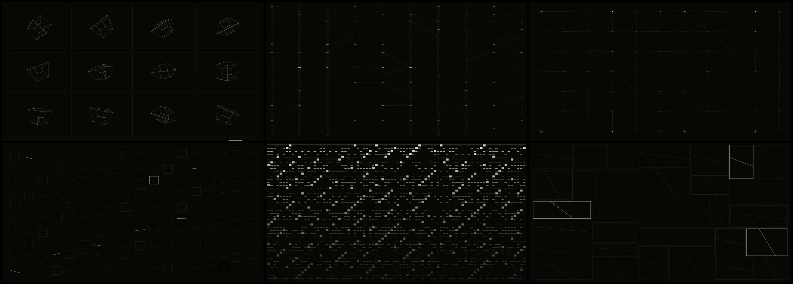
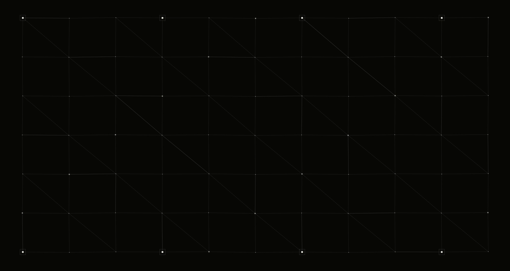
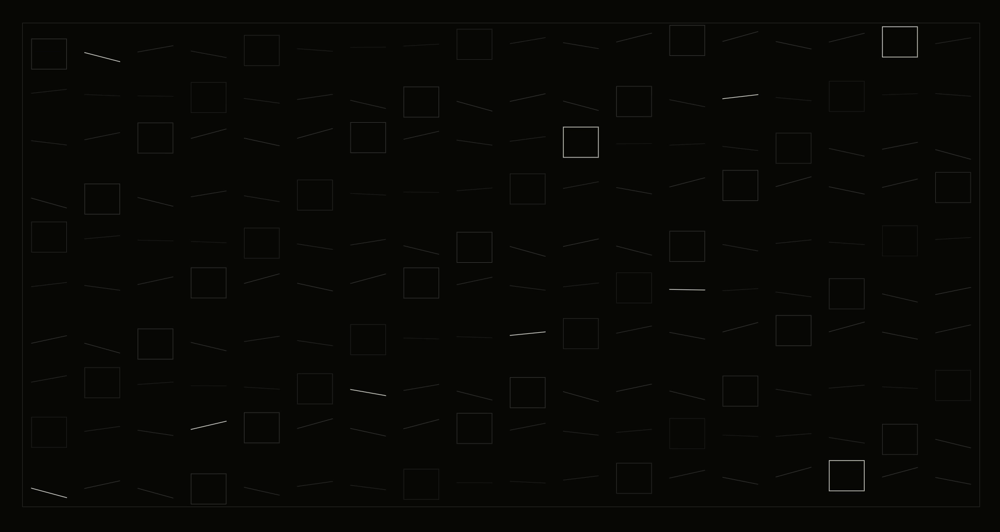
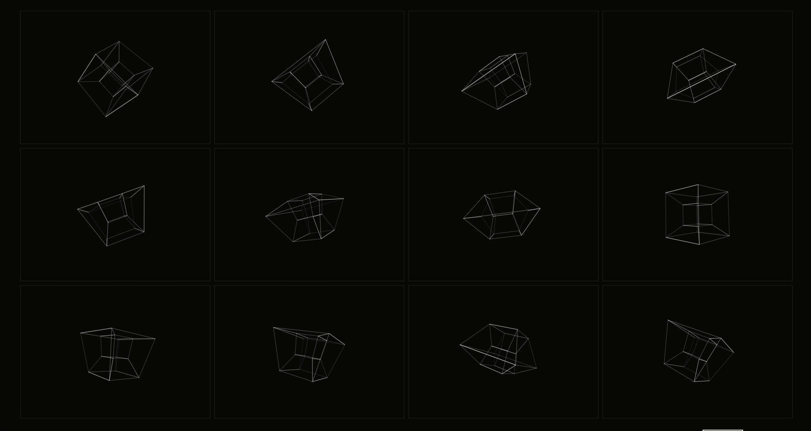
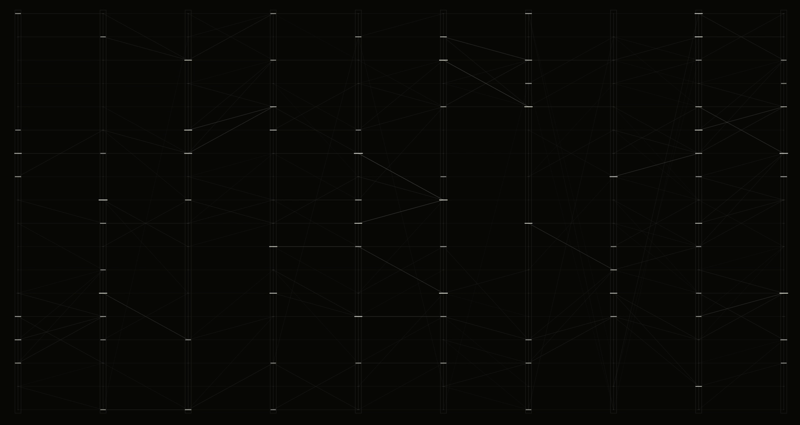
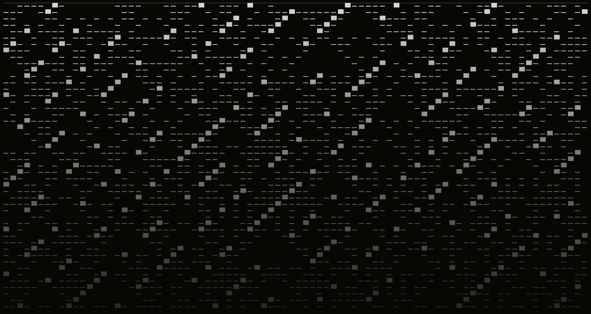
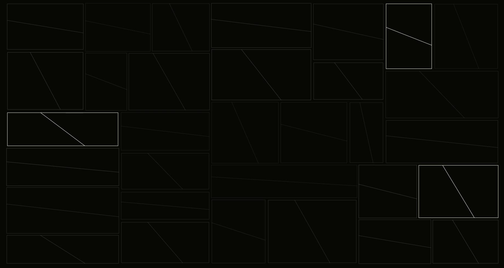
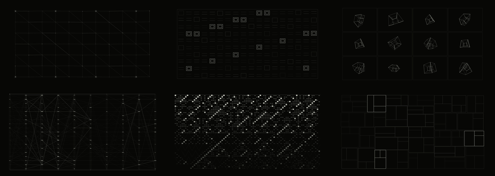
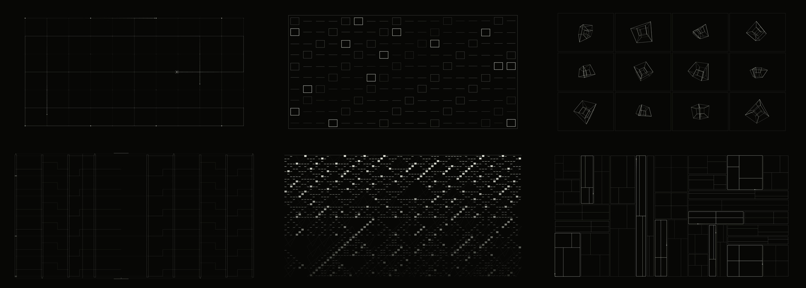

# 《无需进一步输入》开发日志｜2026-08-16

> Mid-development log / Browser V0.2 → V0.4 / Generative audiovisual system

- **Object**：六状态浏览器生成系统与一次约 2 分钟运行记录
- **Method**：通过录屏、缩略图检查和逐状态判断，持续删减界面并细化视觉规则
- **Record**：2026-08-16 13:21:49，1840 × 980 屏幕录制；本页保留六张代表帧
- **继续阅读**：[当前项目档案](./no-further-input-required-2026.md) / [WIP 专题页](../works/no-further-input-required.html) / [独立运行原型](../works/no-further-input-required-v0.html)

## 这一轮形成的判断

本轮的关键变化不是增加更多效果，而是逐步确认作品应当以纯生成画面成立。早期原型中的标题、状态说明、运行读数和常驻控制削弱了作品本身；V0.2 起，默认画面只保留生成系统，控制界面仅在操作时短暂出现。

第二个判断是：六个状态不能只是同一种线框语言的不同排列。每个状态需要拥有独立算法、独立时间行为和可继续发展的内部变体。索引场首先达到较高完成度，随后其他状态分别沿着约束求解、高维投影、异步信号传播、细胞自动机和递归分割发展。

第三个判断来自录屏缩略图。部分细线在全屏运行时成立，但缩小后迅速消失。V0.3 因此建立细线、主结构线和激活线三级线宽与明度，使画面既保持克制，也能在屏幕录制、缩略图和作品文档中保留结构。

## 六个状态的修正

### 01 约束机构 / Constraint

从单点扰动扩展为三种规律性脉冲：逐列、逐行和局部径向冲击。次级横杆、竖杆与对角支撑随节奏切换，位移幅度增大，但仍由距离约束持续拉回。

### 02 索引场 / Index Field

保留原有网格骨架，并加入方框、嵌套索引、错位竖条和双向折线等内部模式。变化发生在同一索引规则中，而不是切换到另一套无关视觉。

### 03 高维投影 / Projection

十二个投影窗口被分为三组，各自使用不同旋转方向、平面与缩放周期。系统周期性把三组姿态收束为近似一致的投影，再重新分散，形成“并行计算—同步—再次分叉”的时间结构。

### 04 信号层 / Signal Layers

保留较安静的待机传播，同时加入扫描、锁存、失活和突发四类节拍。各层使用不同更新时钟，数字只在寄存、校准和音频 onset 时短暂出现，不成为常驻信息界面。

### 05 量化记忆 / Quantized Memory

细胞自动机从单一 XOR 规则扩展为四种二值更新规则，并以不同方式注入新状态。背景中的三角形隐纹随规则改变方向、密度与细分方式，使有限记忆不仅表现为亮点，也保留较弱的结构痕迹。

### 06 递归装配 / Recursive Assembly

矩形分割与重新装配的整体框架被保留。每个模块的斜线增加一至两级内部细分；移动速度分为平稳、快速响应和错峰追随三种节奏，使装配过程能够跟随音频能量和段落变化。

### V0.3 调整后

下图记录线宽层级与六状态内部变体完成后的浏览器运行结果。画面保持纯黑白，控制层处于隐藏状态。

## V0.4：从音频可视化到视觉乐器

V0.4 加入 72–156 BPM 本地 transport 和原创 WebAudio 生成乐器。确定的 16-step pattern 生成低频脉冲、短噪声、金属点击、低音序列与稀疏和声；声音与视觉共享 step、beat 和 phrase。浏览器仍支持麦克风设备选择与本地音频输入。

同一轮修正将约束机构的无因抖动改成确定路径上的匀速行进与 trace；索引场改为每 16 拍换形并连续 morph；信号层收束为稀疏正交路由；递归装配改用固定拓扑的规则分割树。默认隐藏的 STYLE 面板开放 LINE、POINT、ARRAY 与 TRACE，参数只在当前会话中改变画面。

视觉事件自动反向生成空间声像、AI 分析画面运动并修改声音规则仍属于研究方向，尚未进入当前浏览器实现。

## 声音素材方向

本轮选择 [MusicRadar / SampleRadar — Micro Modulars](https://www.musicradar.com/news/sampleradar-synth-week-2024-special-grab-3569-free-synth-samples) 作为下一阶段试听素材。该包包含 Bastl Kastle、Kastle Drum 与 Volca Modular 的 loop 和 one-shot，重点是颗粒鼓击、模块化脉冲、drone 与 sci-fi FX，适合拆分为视觉事件，而不是直接套用完整歌曲段落。

官方允许免版税用于音乐与影像制作，但不允许重新分发原始采样。因此原始音频不进入本仓库；后续只有在完成声音设计、混合和授权复核后，才会加入作品可发布的声音结果。

## 当前边界

### 已实现

- 六个独立视觉状态及其内部变体；
- 固定按 1→2→3→4→5→6→1 循环的状态链，与约 1.18 秒机械遮板转场；
- 72–156 BPM 本地生成乐器、麦克风设备选择与本地音频；
- `NEXT / HOLD / AUTO`、LINE / POINT / ARRAY / TRACE 与默认隐藏的控制层；
- 会话内操作日志，不跨会话保存，也不改变状态顺序或持续时间。

### 开发中

- 本地乐器的音色、混音与六状态映射调校；
- Micro Modulars 素材试听、筛选和二次声音设计；
- 10–20 分钟连续运行与最终 8–10 分钟影像结构；
- 视觉事件接口与空间音频参数设计。

### 研究假设 / 尚未实现

- AI 分析视觉运动并生成空间音频；
- AI 根据视觉运动自动生成空间音频或修改声音规则；
- preference history 与 transition weight 自适应；
- 系统学习或吸收艺术家偏好。

这次开发节点保存的不是一个已经完成的答案，而是一组逐步变得明确的判断：删掉解释层，让画面本身成立；让六个状态真正不同；让节奏进入算法；让视觉最终能够被演奏。
