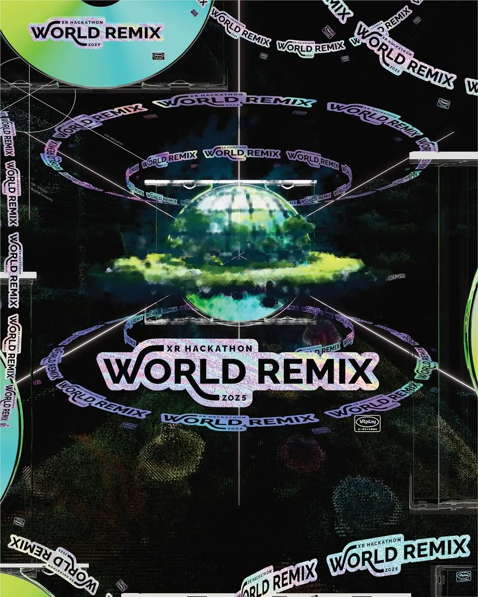

# VR Play WORLD REMIX XR 黑客松 2025

> 活动主视觉、动态 / 静态物料与周边视觉系统

## 项目信息

| 项目 | 内容 |
|------|------|
| **时间** | 2025/07 |
| **地点** | 北京 / 上海 / 广州 |
| **项目** | VR Play WORLD REMIX XR 黑客松 2025 |
| **角色** | 视觉制作 |

## 工作内容

- 活动主视觉系统制作
- 动态 / 静态传播物料
- 印刷与周边视觉
- 空间与物料延展

## 2025 视觉语言

这一版 WORLD REMIX 建立了后续可继续发展的核心视觉资产：

- 镭射 CD / Disc
- 磁带与实体媒体载体
- WORLD REMIX 重复字带 / Orbit
- 黑色数字空间
- Grid / Coordinate / Wireframe
- Code / Terminal 信息层
- Point Cloud / Gaussian 植物与温室影像
- 游戏包装盒式的实体周边语言

2026 不准备把这些元素全部推翻，而是把它们从“视觉拼贴”进一步升级为空间、网页、动态和 Sponsor 展示都可以共享的世界构造规则。

## 后续归档

- [2025 视觉资产归档与去重](../docs/vrplay-world-remix-2025-visual-archive.md)
- [WORLD REMIX 视觉设定](../docs/vrplay-world-remix-visual-system.md)
- [VR Play Hackathon / WORLD REMIX 2026](./vrplay-ai-xr-hackathon-2026.md)
